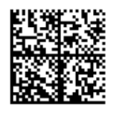
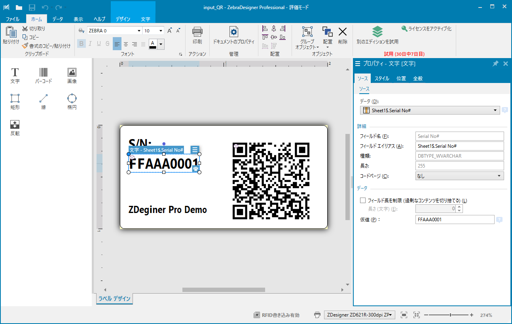
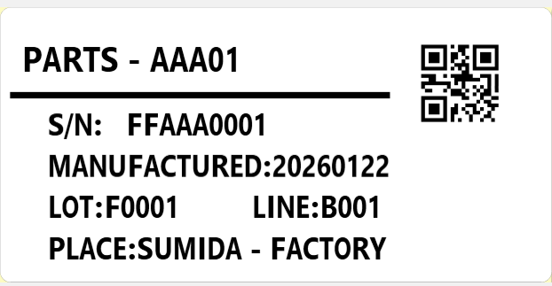

#### Demo-04_Scan_And_Print_via_ZDesigner3-Pro
# Zebra Designer 3 Proを用いたスキャン＆プリントデモ

自動認識（オートID）業界に携わっておりますと、スキャンデータを基にラベル印刷を行うというニーズを頻繁に目にします。しかしながら、こうした仕組みは十分に浸透しているとは言えません。

現場からは、「導入コストが高額で手が出せない」「社内に企画・検討をリードできるITエンジニアがおらず、二の足を踏んでいる」といった切実な声を多く頂戴します。

実のところ、ゼブラ社のソリューションを活用すれば、汎用的なプロセスであれば驚くほどシンプルかつ低コストで構築が可能なケースがあります。

本稿では、標準的な「スキャン＋印刷」プロセスの自動化を検討されている方々の参考となるよう、基礎的なデモの手順をご紹介いたします。

### デモの想定シーン

製造現場では、個品管理のために多種多様なデータが格納されたQRコードが広く活用されています。しかし、各工程（プロセス）においては、その膨大なデータの中から必要な情報のみを抽出し、工程専用のラベルとして再発行するタスクが頻繁に発生します。

本稿では、こうした実運用を想定したデモ環境の構築方法を解説します。一連のプロセスを実際に体験いただくことで、効率的なラベル発行ソリューションの具体像を提示いたします。

  

## 0. 本手順で必要なマテリアル
 

#### 構成イメージ
    

1. Zebra Link-OS プリンタ 

1. Zebra DSスキャナ (本稿ではUSBを前提に説明) 

1. 印刷用のラベル・リボン
   添付のサンプルは、2x1 inchラベル向けに作成されています。 

2. Window 11 以上のPC 
   - 要: Zebra Designer v10 ドライバ
   - 要: Zebra Designer 3 Professional
   - 要: Zebra 123Scan
  
3. PC <--> プリンタ接続用のUSBケーブル
 

## 1. 123Scan操作：スキャナの設定
 

1. （**重要**）スキャナの初期化

   

 

1. DSスキャナで下記の設定バーコードを読み取り。
   
   

    #### ワンポイント解説

    123Scanを用いて、マニュアルで設定をする場合は下記設定内容か、添付の[123Scan設定ファイル](./Barcode-DS9308_delay-00ms.scncfg)を参考に設定をすること。 
   
 

## 2. 個品ラベルの印刷

1. 本稿に添付されている下記ファイルをダウンロードする。
    - [input_QR.nlbl](./input_QR.nlbl)
    - [input_QR.xlsx](./input_QR.xlsx) 
     

2. 本ページに添付されている**input_QR.nlbl**をZDesigner 3 Proで起動する。 
    
    

2. **ファイル** → **印刷**を選択し、印刷画面に遷移する。 
    
    

3. 印刷先プリンタの設定をする。 
     
     

1. 印刷ボタンを押下し、印刷する。
    * サンプルではラベルが3枚印刷される。 

  

## 3. デモ印刷
 

1. PCにプリンタとスキャナを接続する。 
    
    

2. 本ページに添付されている下記ファイルをZDesigner 3 Proで起動する。 
   [サンプルプログラム：output_QR.nlbl](./output_QR.nlbl)
    

3. **ファイル** → **印刷**を選択し、印刷画面に遷移する。 
     
     

1. 印刷先プリンタの設定をする。
     
     

2. **変数キーボード** > **バーコード**が選択された状態にする。 
     

    **※（重要）この時、Windows PCの入力が半角英数になっていることを確認すること！！全角入力となっている場合は、半角英数に変更すること。**
     

    

     

3. 個品ラベルのQRコードを（連続）スキャンし、QRに応じたパーツラベルが印刷されることを確認する。
    
 

-- End: Enjoy Zebra!
